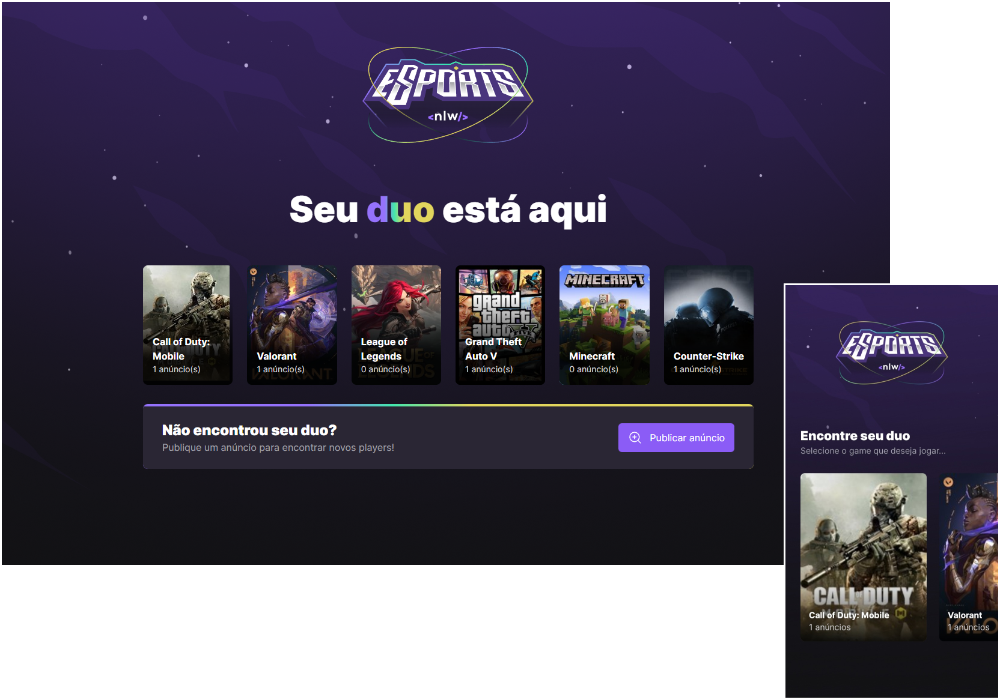

<h1 align="center">Find Your Duo</h1>

  

## 💻 Projeto

O Find Your Duo é um projeto que ajuda você a encontrar uma pessoa para jogar junto. Este projeto foi desenvolvido na trilha ignite do evento Next Level Week - eSports.

## ✨ Tecnologias

Esse projeto foi desenvolvido com as seguintes tecnologias:

- [React](https://reactjs.org)
- [TypeScript](https://www.typescriptlang.org/)
- [Vite](https://vitejs.dev/)
- [Expo](https://docs.expo.dev/)
- [React Native](https://reactnative.dev/)
- [Prisma](https://www.prisma.io/)
- [Express](https://expressjs.com/pt-br/)
- [Radix UI](https://www.radix-ui.com/)
- [Tailwind CSS](https://tailwindcss.com/)

## 🚀 Como executar

- Clone o repositório
- Navegue até a pasta de cada aplicação (mobile, server e web) e instale as dependências com `npm install`
- Siga as instruções para cada uma das aplicações abaixo:

### server

- Crie o banco de dados e execute as migrations com `npx prisma migrate dev`
- Faça uma copia do arquivo `.env.example` para `.env` e configure suas variáveis de ambiente
- Inicie o servidor com `npm run dev`

### web

- Faça uma copia do arquivo `.env.example` para `.env.local` e configure suas variáveis de ambiente
- Inicie a aplicação web com `npm run dev`

### mobile

- Edite o arquivo `env.ts` de acordo com seu ambiente
- Inicie a aplicação mobile com `npx expo start`

## 📄 Licença

Esse projeto está sob a licença MIT. Veja o arquivo [LICENSE](LICENSE) para mais detalhes.

---

Desenvolvido por Tiago Faria.
